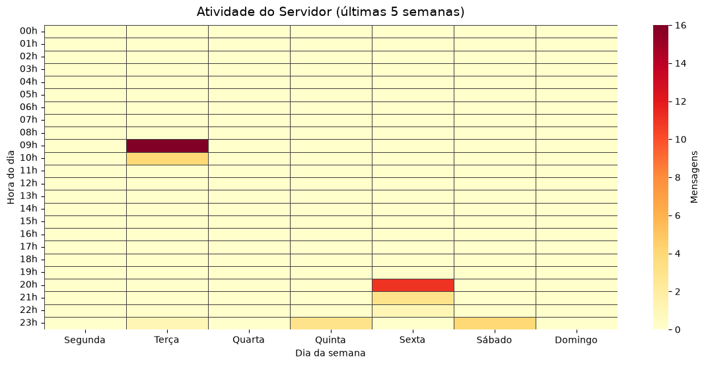
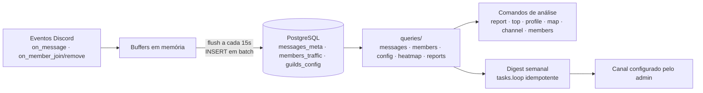

# 🌱 XiloVê

> Uma camada de observabilidade para servidores Discord: entenda o ritmo, o movimento
> e as conexões da sua comunidade.

[](#)
[](#)
[](#)
[](#)

**[🔗 Adicionar ao seu servidor](https://discord.com/oauth2/authorize?client_id=1501777296950825121&permissions=4506247475616960&integration_type=0&scope=bot)**

---

## O que é

O **XiloVê** coleta passivamente a atividade de um servidor Discord (mensagens e
entradas/saídas de membros) e a transforma em métricas acionáveis: relatórios por
período, heatmap horário 7×24, ranking de membros, perfil individual e um
**relatório semanal automático** com comparação semana-a-semana.

Este repositório é uma **vitrine de engenharia**: documenta a arquitetura, o modelo
de dados e as decisões de projeto. O código-fonte completo é privado; o **bot está
ao vivo** e pode ser adicionado a qualquer servidor.

---

## ✨ Features

| Feature                                                   | Comando                    |
| --------------------------------------------------------- | -------------------------- |
| Relatório por período (dia/semana/mês/semestre/ano)       | `x!report <d\|w\|m\|s\|y>` |
| Heatmap horário 7×24 (imagem gerada com seaborn)          | `x!map [y/n]`              |
| Ranking de membros com paginação                          | `x!top`                    |
| Perfil individual de atividade                            | `x!profile [@user]`        |
| Estatísticas de um canal específico                       | `x!channel [#canal]`       |
| Entradas/saídas de membros                                | `x!members`                |
| Relatório semanal automático com delta vs semana anterior | `x!digest`                 |
| Exibe todos os comandos do bot                            | `x!help`                   |

---

## 🖼️ Visual


_Heatmap de atividade por dia-da-semana × hora, no fuso horário do servidor._

---

## 🏗️ Arquitetura



**Princípios:**

- **Ingestão desacoplada da escrita:** eventos vão pra buffers em memória e são
  gravados em batch a cada 15s (1 transação, N linhas) — não um `INSERT` por mensagem.
- **Leitura por domínio:** queries organizadas em pacote por tabela, com fachada
  (`queries/__init__.py`) e orquestração separada (`reports.py`).
- **Agendamento idempotente:** o digest semanal envia **exatamente 1x por semana por
  servidor**, mesmo com restarts.

---

## 🗄️ Modelo de dados

| Tabela            | Papel                                                                                        |
| ----------------- | -------------------------------------------------------------------------------------------- |
| `messages_meta`   | `(guild_id, channel_id, user_id, created_at, char_length)` — fato de mensagem                |
| `members_traffic` | `(guild_id, user_id, event_type, created_at)` — joins/leaves                                 |
| `guilds_config`   | `(guild_id, timezone, created_at, report_channel_id, digest_enabled, last_weekly_report_at)` |

Índices em `(guild_id, created_at)` sustentam todas as janelas temporais.
DDL completo em [`sql/schema.sql`](sql/schema.sql).

---

## 🧠 Decisões de engenharia

### 1. Buffer + batch insert, não insert por evento

Um servidor ativo gera picos de mensagens. Escrever linha a linha saturaria o banco.
Eventos são acumulados em memória e descarregados em `executemany` dentro de uma
transação; em falha, o batch é **re-inserido na frente do buffer** (nada se perde).

### 2. Scheduler semanal idempotente, sem dia fixo global

Cada servidor tem seu "slot" semanal derivado do `created_at` da configuração
(weekday + hora, no fuso do guild). Isso **distribui a carga** naturalmente (evita
thundering-herd) e respeita o fuso local. A idempotência vem de
`last_weekly_report_at < slot`: envia uma vez, grava o slot; semana nova gera slot
maior e o ciclo recomeça. Survive restarts sem duplicar.

### 3. Timezone como cidadão de primeira classe

Toda agregação usa `AT TIME ZONE <tz do guild>`; `TIMESTAMPTZ` armazena em UTC e a
comparação de datetimes _aware_ funciona entre fusos. "Semana" e "turno" significam
a semana e o turno **do servidor**, não do datacenter.

---

## 🔎 Trechos selecionados

Excertos sanitizados em [`snippets/`](snippets/):

- **`ingestion_flush.py`** — o loop de flush com re-inserção em falha.
- **`weekly_scheduler.py`** — `compute_weekly_slot` + tick idempotente.
- **`offset_queries.sql`** — o padrão de janela deslizante (`interval` + `offset`)
  que habilita comparação semana-a-semana sem snapshot:

```sql
-- janela deslizante: $3 = dias, $4 = offset (0 = atual, 7 = semana anterior)
AND created_at >= DATE_TRUNC('day', (NOW() AT TIME ZONE $2) - (($3::int + $4::int) * INTERVAL '1 day')) AT TIME ZONE $2
AND created_at <  DATE_TRUNC('day', (NOW() AT TIME ZONE $2) + INTERVAL '1 day' - ($4::int * INTERVAL '1 day')) AT TIME ZONE $2
```

---

## 🧰 Stack

`Python 3.14` · `discord.py` · `asyncpg` · `PostgreSQL` · `pandas` · `seaborn` ·
`matplotlib` · `asyncio.tasks` · `zoneinfo`

---

## 🔒 Privacidade & código

O XiloVê **não armazena conteúdo de mensagens** — apenas metadados agregados
(contagens, timestamps, comprimento). Servidores removidos têm seus dados apagados
automaticamente. O código-fonte completo é **privado**; este repositório documenta a
arquitetura e disponibiliza o schema e trechos ilustrativos. O bot está **ao vivo**:
[adicione-o](https://discord.com/oauth2/authorize?client_id=1501777296950825121&permissions=4506247475616960&integration_type=0&scope=bot) e explore com `x!help`.

---

*Feito por **[Kayo Araujo](https://github.com/kayobass)***
