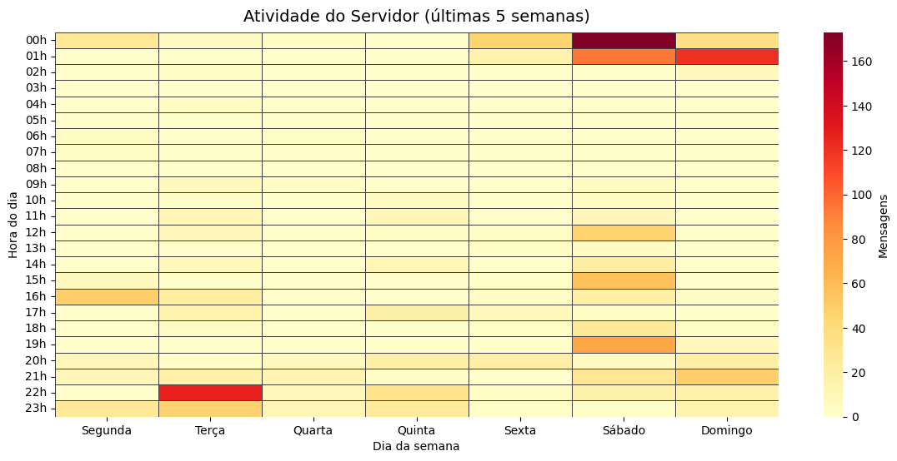
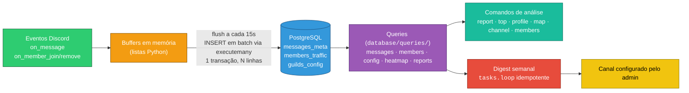

# 🌱 XiloVê

> Uma camada de observabilidade para servidores Discord: entenda o ritmo, o movimento
> e as conexões da sua comunidade.

[](https://www.python.org/)
[](https://discordpy.readthedocs.io/)
[](https://github.com/MagicStack/asyncpg)
[](https://www.postgresql.org/)
[](https://pandas.pydata.org/)
[](https://seaborn.pydata.org/)
[](#features)
[](LICENSE)

**[🔗 Adicionar ao seu servidor](https://discord.com/oauth2/authorize?client_id=1501777296950825121&permissions=4506247475616960&integration_type=0&scope=bot)**

---

## O que é

O **XiloVê** coleta passivamente a atividade de um servidor Discord (mensagens e
entradas/saídas de membros) e a transforma em métricas acionáveis: relatórios por
período, heatmap horário 7×24, ranking de membros, perfil individual e um
**relatório semanal automático** com comparação semana-a-semana.

Este repositório é uma **vitrine de engenharia**: documenta a arquitetura, o modelo
de dados e as decisões de projeto. O código-fonte completo é privado; o **bot está
ao vivo** e pode ser adicionado a qualquer servidor.

---

## ✨ Features

| Feature                                                   | Comando                    |
| --------------------------------------------------------- | -------------------------- |
| Relatório por período (dia/semana/mês/semestre/ano)       | `x!report <d\|w\|m\|s\|y>` |
| Heatmap horário 7×24 (imagem gerada com seaborn)          | `x!map [y/n]`              |
| Ranking de membros com paginação                          | `x!top`                    |
| Perfil individual de atividade                            | `x!profile [@user]`        |
| Estatísticas de um canal específico                       | `x!channel [#canal]`       |
| Entradas/saídas de membros                                | `x!members`                |
| Relatório semanal automático com delta vs semana anterior | `x!digest`                 |
| Exibe todos os comandos do bot                            | `x!help`                   |

---

## 🖼️ Visual


_Heatmap 7x24 Heatmap de atividade por dia-da-semana × hora do dia, no fuso horário do servidor._

---

## 🏗️ Arquitetura


```mermaid
flowchart LR
    A["Eventos Discord<br>on_message<br>on_member_join/remove"] --> B["Buffers em memória<br>(listas Python)"]
    B -->|"flush a cada 15s<br>INSERT em batch via executemany<br>1 transação, N linhas"| C[("PostgreSQL<br>messages_meta<br>members_traffic<br>guilds_config")]
    C --> D["Queries (<code>database/queries/</code>)<br>messages · members · config · heatmap · reports"]
    D --> E["Comandos de análise<br>report · top · profile · map · channel · members"]
    D --> F["Digest semanal<br><code>tasks.loop</code> idempotente"]
    F --> G["Canal configurado pelo admin"]

    style A fill:#2ECC71,stroke:#1a5e3a,color:#fff
    style B fill:#F39C12,stroke:#7a4c00,color:#fff
    style C fill:#3498DB,stroke:#1a4d7a,color:#fff
    style D fill:#9B59B6,stroke:#4a226e,color:#fff
    style E fill:#1ABC9C,stroke:#0f6b5e,color:#fff
    style F fill:#E74C3C,stroke:#8a1a0d,color:#fff
    style G fill:#F1C40F,stroke:#8a7a00,color:#000
```

**Princípios:**

| Princípio             | Detalhe                                                                                                  |
| --------------------- | -------------------------------------------------------------------------------------------------------- |
| **Ingestão async**    | Eventos vão para buffers em memória, flushados a cada 15s em batch transacional. Zero `INSERT` por evento. |
| **Recovery de falha** | Em erro no flush, o batch é re-inserido **na frente do buffer** - dados não são perdidos.                  |
| **Leitura por domínio** | Queries organizadas por tabela, com fachada `queries/__init__.py` e orquestração `reports.py`.            |
| **Idempotência**      | O digest envia **exatamente 1× por semana por servidor**, sobrevive restarts sem duplicar.                 |
| **Timezone-first**    | Toda agregação usa `AT TIME ZONE`; "semana" e "turno" são do fuso do **servidor**.                         |

---

## 🗄️ Modelo de dados

| Tabela            | Colunas (resumo)                                                   | Índice                          |
| ----------------- | ------------------------------------------------------------------ | ------------------------------- |
| `guilds_config`   | `guild_id` PK, `timezone` NOT NULL, `report_channel_id`, `prefix`, `digest_enabled`, `created_at`, `last_weekly_report_at`, `ignored_channels` (array) | —                               |
| `messages_meta`   | `id` (auto), `guild_id`, `channel_id`, `user_id`, `created_at` (TIMESTAMPTZ), `char_length` | `(guild_id, created_at)`        |
| `members_traffic` | `id` (auto), `guild_id`, `user_id`, `event_type` (SMALLINT -1/1), `created_at` (TIMESTAMPTZ) | `(guild_id, created_at)`        |
| `opt_outs`        | `user_id` PK, `created_at`                                         | —                               |

DDL completo e idempotente em [`sql/schema.sql`](sql/schema.sql).

---

## 🧠 Decisões de engenharia

### 1. Buffer + batch insert, não insert por evento

Um servidor ativo gera picos de mensagens. Escrever linha a linha saturaria o banco.
Eventos são acumulados em memória e descarregados em `executemany` dentro de uma
transação; em falha, o batch é **re-inserido na frente do buffer** (nada se perde).

### 2. Scheduler semanal idempotente, sem dia fixo global

Cada servidor tem seu "slot" semanal derivado do `created_at` da configuração
(weekday + hora, no fuso do guild). Isso **distribui a carga** naturalmente (evita
thundering-herd) e respeita o fuso local. A idempotência vem de
`last_weekly_report_at < slot`: envia uma vez, grava o slot; semana nova gera slot
maior e o ciclo recomeça. Survive restarts sem duplicar.

### 3. Timezone como cidadão de primeira classe

Toda agregação usa `AT TIME ZONE <tz do guild>`; `TIMESTAMPTZ` armazena em UTC e a
comparação de datetimes _aware_ funciona entre fusos. "Semana" e "turno" significam
a semana e o turno **do servidor**, não do datacenter.

---

## 🔎 Trechos selecionados

Excertos sanitizados em [`snippets/`](snippets/):

- **`ingestion_flush.py`** - o loop de flush com re-inserção em falha.
- **`weekly_scheduler.py`** - `compute_weekly_slot` + tick idempotente.
- **`offset_queries.sql`** - o padrão de janela deslizante (`interval` + `offset`)
  que habilita comparação semana-a-semana sem snapshot:

```sql
-- janela deslizante: $3 = dias, $4 = offset (0 = atual, 7 = semana anterior)
AND created_at >= DATE_TRUNC('day', (NOW() AT TIME ZONE $2) - (($3::int + $4::int) * INTERVAL '1 day')) AT TIME ZONE $2
AND created_at <  DATE_TRUNC('day', (NOW() AT TIME ZONE $2) + INTERVAL '1 day' - ($4::int * INTERVAL '1 day')) AT TIME ZONE $2
```

---

## 🧰 Stack

| Categoria       | Tecnologia                                                                 |
| --------------- | --------------------------------------------------------------------------- |
| **Linguagem**   | Python 3.12+                                                                |
| **Framework**   | `discord.py` 2.3+                                                           |
| **Database**    | PostgreSQL 15+ · `asyncpg` (pool: min=2, max=14)                           |
| **Data viz**    | `pandas` · `seaborn` · `matplotlib`                                         |
| **Async**       | `asyncio` (tasks, gather, to_thread, Semaphore)                             |
| **Timezones**   | `zoneinfo` (IANA)                                                           |
| **Health check**| `microdot` (HTTP, single-thread)                                            |
| **Infra**       | Supabase (PostgreSQL como serviço)                                          |


---

## 🔒 Privacidade & código

O XiloVê **não armazena conteúdo de mensagens** - apenas metadados agregados
(contagens, timestamps, comprimento). Servidores removidos têm seus dados apagados
automaticamente. O código-fonte completo é **privado**; este repositório documenta a
arquitetura e disponibiliza o schema e trechos ilustrativos. O bot está **ao vivo**:
[adicione-o](https://discord.com/oauth2/authorize?client_id=1501777296950825121&permissions=4506247475616960&integration_type=0&scope=bot) e explore com `x!help`.

---

*Feito por **[Kayo Araujo](https://github.com/kayobass)***
